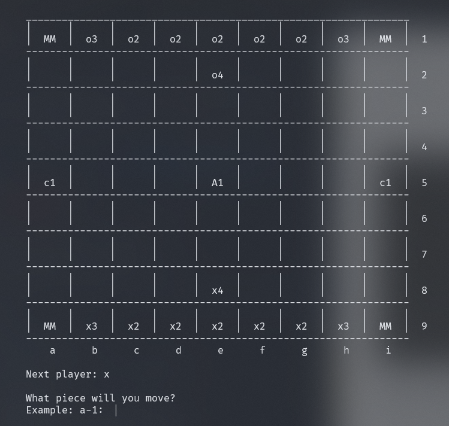

# Three Dragons

[](https://github.com/ctrlMarcio/feup-plog/blob/master/LICENSE) [](https://sicstus.sics.se/)

Resolution proposal for the first project of the Logic Programming course unit @ FEUP, a game board called [**Three Dragons**](https://boardgamegeek.com/boardgame/306972/three-dragons), based on the works of Scott Allen Czysz.
[Official Board and Rules](https://drive.google.com/drive/folders/1xNoHSM08SChVW2TWtzU8Qje6m7hxrEYh).

- [Three Dragons](#three-dragons)
  - [Who and What](#who-and-what)
  - [Instalation and Execution](#instalation-and-execution)
  - [Drogon, Rhaegal, and Viserion?](#drogon-rhaegal-and-viserion)
    - [The Game Board](#the-game-board)
    - [Pieces](#pieces)
      - [Dragons](#dragons)
  - [Game Logic](#game-logic)
    - [Game State Representation](#game-state-representation)
    - [Board](#board)
    - [Current Player](#current-player)
    - [Representation in Prolog](#representation-in-prolog)
      - [Initial Game Board](#initial-game-board)
      - [Intermediate Game Board Example](#intermediate-game-board-example)
      - [Final Game Board Example](#final-game-board-example)
      - [Piece Representation](#piece-representation)
  - [Visualization of the Game State](#visualization-of-the-game-state)
    - [Visualization of the Board](#visualization-of-the-board)
  - [List of Valid Moves](#list-of-valid-moves)
  - [Moves Execution](#moves-execution)
  - [End of the Game](#end-of-the-game)
  - [Board Evaluation](#board-evaluation)
  - [Computer Move](#computer-move)
  - [Conclusion](#conclusion)
    - [Known issues](#known-issues)
  - [Bibliography](#bibliography)
  - [Documentation](#documentation)
  - [License](#license)

___

## Who and What

- Three Dragons 2 made with ❤ by
  - Leonor Gomes, up201806567 • [GitHub](https://github.com/leonormgomes) • [Sigarra](https://sigarra.up.pt/feup/pt/fest_geral.cursos_list?pv_num_unico=201806567)
  - Márcio Duarte, up201909936 • [GitHub](https://github.com/ctrlMarcio) • [Sigarra](https://sigarra.up.pt/feup/pt/fest_geral.cursos_list?pv_num_unico=201909936)

## Instalation and Execution

In order to play the game, execute the following steps:
- On Windows:
  - SICStus console
    - Open the SICStus console and click on File->Consult; 
    - Choose the **three_dragons.pl** file from the source code folder;
  - SICStus executable
    - Add the executable to the environment variable path;
    - Open a terminal window and execute `sicstus`;
    - Execute `consult([path to the source code]/three_dragons.pl).`.
- On Linux:
   - Open a terminal window and execute the following command **sisctus-4.6.0.**;
   - Write `consult([path to the source code]/three_dragons.pl).`;
 - Run `play.` to play the game.

## Drogon, Rhaegal, and Viserion?

**AKA game description**

Three dragons is a board game heavily inspired by ancient games such as Petteia, Tablut and Hnefatafi with some interesting additions:

1. Pieces have strength and can capture pieces with lower strength
2. There are "dragon caves", which can summon "dragons", more on that below

### The Game Board


The game is named by the three triangular symbols across the center of the board representing dragon caves. In the four corners there are "mountains" that cannot be occupied by player pieces nor moved across. The same precedent is applied to the dragon caves.

The initial disposition of the board, according to the official rules is as so:


### Pieces

Each player starts with 8 pieces, 5 with strength 2, 2 with strength 3 and 1 with strength 4.

Pieces move like a rook in chess, orthogonally, and any number of squares.

Pieces can be captured in two ways:

- by strength: a piece (1) with higher strength can capture another (2) with lower strength. The piece (1) will after loose a level of strength;
- by custodial: a piece is surrounded on both sides either by 2 enemy pieces or an enemy piece and an obstacle (dragon cave or mountain).

When a capture is made, the losing piece should be removed from the game.

The game ends when one of the players only has one piece left, hence the other player is declared the winner.

#### Dragons

Dragons are regular pieces that can only be spawned whenever its cave is surrounded by all orthogonal sides. Only one dragon can be spawned from each cave. The side caves spawn a dragon with strength 3, while the main cave spawns a strength 5 dragon.

## Game Logic

### Game State Representation

In its essence, the game state is no more than an array that contains the state information. The array is stored as follows [Board, Player, PlayerPieces, OpponentPieces, CaveL, CaveM, CaveR], where

- **Board** is a matrix that stores the board;
- **Player** is the current player;
- **PlayerPieces** is the number of pieces of the current player;
- **OpponentPieces** is the number of pieces of the opponent of the current player;
- **CaveL**, **CaveM**, and **CaveR** are designations of the three current caves, storing the number of dragons that can enter the game independently.

For ease of use, helper rules were implemented, where one can either get from or update a game state, such as:

```prolog
% [...]
% gets the game state's board and current player to the Board and Player variables respectively
game_state(GameState, [board-Board, current_player-Player]),

% [...]
% updates the GameState1's current_player, player_pieces and opponent_pieces into NewGameState
set_game_state(GameState1, [current_player-NextPlayer, player_pieces-PlayerPieces, opponent_pieces-OpponentPieces], NewGameState).

% (the code above can be seen in the play. rule)
```

### Board

The game board is represented through a matrix or, in Prolog, a list of lists.

```prolog
| ?- init_board(X).
X = [['MM',o3,o2,o2,o2,o2,o2,o3,'MM'],['  ','  ','  ','  ',o4,'  ','  ','  ','  '],['  ','  ','  ','  ','  ','  ','  ','  '|...],['  ','  ','  ','  ','  ','  ','  '|...],[cc,'  ','  ','  ','AA','  '|...],['  ','  ','  ','  ','  '|...],['  ','  ','  ','  '|...],['  ','  ','  '|...],['MM',x3|...]] ?
```

### Current Player

The current player is stored in a single atom, and exchanged between plays.

```prolog
% global atom recognition
player1(x).
player2(o).

% the next player based on the last one
next_player(x, o).
next_player(o, x).
```

### Representation in Prolog

#### Initial Game Board

The game board's width and height can be updated (defaulting at 9), future proofing the game in case new variants appear:

```prolog
board_width(9).
board_height(9).
```

In order to build a dynamic initial game state, one has to take in consideration the current dimensions of the board itself. Consequently, the building of the board is not simple. Its most high level rule can be seen below:

```prolog
init_board(Board) :-
    % initializes the top half of the board
    second_player(Second),
    init_board_half(Second, Half1),

    % initializes the middle row
    init_middle_row(MiddleRow),
    append(Half1, [MiddleRow], Board1),

    % initializes the bottom half
    first_player(First),
    init_board_half(First, Half2Reversed),
    reverse(Half2Reversed, Half2),

    append(Board1, Half2, Board).
```

#### Intermediate Game Board Example

As stated in the assignment, the intermediate and end game board examples are expected to be hard coded, instead of calculated. (For the sake of fidelity, all the present examples were taken from a real game of Three Dragons played amongst the members of this group).

These operations are performed as such:

```prolog
show_intermediate_state :-
    write_header,
    inter1_state(GameState),
    first_player(Player),
    display_game(GameState).

inter1_state(GameState) :-
    empty_board(Tmp),
    insert_matrix(o2, Tmp, 1, 3, Tmp1),
    insert_matrix(o2, Tmp1, 1, 4, Tmp2),
    insert_matrix(o2, Tmp2, 1, 5, Tmp3),
    insert_matrix(o2, Tmp3, 2, 9, Tmp4),
    insert_matrix(x2, Tmp4, 3, 1, Tmp5),
    insert_matrix(o4, Tmp5, 4, 2, Tmp6),
    insert_matrix(x2, Tmp6, 5, 3, Tmp7),
    insert_matrix(o2, Tmp7, 5, 8, Tmp8),
    insert_matrix(x3, Tmp8, 7, 1, Tmp9),
    insert_matrix(x3, Tmp9, 9, 2, Tmp10),
    insert_matrix(x2, Tmp10, 9, 3, Tmp11),
    insert_matrix(x2, Tmp11, 9, 5, Tmp12),
    insert_matrix(x2, Tmp12, 9, 7, GameState).
```

For this operation to be possible, it was required to implement a rule that would create a board with no more than the static elements, this is, without the playable pieces. This rule's called `empty_board/1` in the example given and runs in the exact same way as the `init_board/1` example stated above, but writing an empty cell in all the correspondent playable pieces.

It was also required to implement a way to insert elements in a list of lists in a friendly approachable way, such rule is stated below (if you want to have a more clear grasp on what's happening, you can take a look at the actual code where it is formally documented: [here](src/util.pl)):

```prolog
insert(Element, [_|T], 1, [Element|T]).
insert(Element, [H1|T1], Position, [H1|T2]) :-
    Position1 is Position - 1,
    insert(Element, T1, Position1, T2).

insert_matrix(Element, [MH|TH], 1, Column, [Res|TH]) :-
    insert(Element, MH, Column, Res).
insert_matrix(Element, [HT|MT], Row, Column, [HT|Res]) :-
    Row > 1,
    Row1 is Row - 1,
    insert_matrix(Element, MT, Row1, Column, Res).
```

The intermediate state example given above produces (and was taken from) this exact game board state:


#### Final Game Board Example

The operations around the final game board example are exactly the same as the one in the intermediate example.

```prolog
show_final_state :-
    write_header,
    final1_state(GameState),
    write_end_board(GameState, o).

final1_state(GameState) :-
    empty_board(Tmp),
    insert_matrix(o2, Tmp, 4, 9, Tmp1),
    insert_matrix(x2, Tmp1, 6, 4, Tmp2),
    insert_matrix(o2, Tmp2, 6, 6, Tmp3),
    insert_matrix(o3, Tmp3, 7, 1, Tmp4),
    insert_matrix(o2, Tmp4, 8, 2, GameState).
```

Resulting in:


> **Note: remember that the game ends when one of the players has only one piece**

#### Piece Representation

More details on the looks are given below ([Visualization of the Game State](#visualization-of-the-game-state)), and, internally, the pieces' implementation  the most complex of the implementations:

```prolog
color_value(o1, o, 1).
color_value(o2, o, 2).
color_value(o3, o, 3).
color_value(o4, o, 4).
color_value(o5, o, 5).
color_value(x1, x, 1).
color_value(x2, x, 2).
color_value(x3, x, 3).
color_value(x4, x, 4).
color_value(x5, x, 5).
```

These `color_value` facts work both ways, upon a piece, `o1` for example, one can easily find its owner and value, being them `o` and `1` respectively in this example. If one owns a piece owner and its value, `color_value` can returns its internal representation as well.

## Visualization of the Game State

The main menu is simply able to update the type of player and start the game. For that, under **src/io/menu.pl** there is a set of rules that ease menu handling that, given the length limits, won't be explored in this README.

Example of menus being used below:


The menus accepts index and value input. For example, in this last example, input `1.` and `g-1.` would result in the same.

### Visualization of the Board

The visualization of the game state predicate is implemented as follows:

```prolog
write_board(Board, NextPlayer) :-
    write_border,
    write_pieces(Board),
    write_next_player(NextPlayer).
```

Starts by writing the top border of the board (merely underscores), draws the board itself, and ends by giving an indication about the next player. When a game ends, it displays the winner instead of the next player.

The drawing of the board also follows a very intuitive and textbook implementation:

```prolog
write_pieces([], 0) :- nl.
write_pieces([H|T], Rows) :-
    write('|'), write_array(H), nl,
    write_line,
    Rows1 is Rows - 1,
    write_pieces(T, Rows1).
```

Writing the pieces of a single row separated by some margin and a `|`. For now, the pieces' representation follows a simple idea: displaying its owner and level, such that `x2` is the representation of a piece owned by the player `x` and with level `2`. The static board elements are:

- **Mx** for the mountain
- **cx** for the small caves
- **Ax** for the large cave

where **x** is the number of dragons left in the given cave.

As is implemented in the code snippet below:

```prolog
empty('  ').
mountain('MM').
possible_move_representation('<>').

caves_row(5).

left_cave_col(1).
middle_cave_col(5).
right_cave_col(9).

cave('c1', 1, 1).
cave('c0', 0, 1).
cave('A1', 1, 5).
cave('A0', 0, 5).
cave('c1', 1, 9).
cave('c0', 0, 9).
```

The caves hold, in the second argument, the number of possible spawns left.

A line, which is no more than a bunch of hyphens (calculated accordingly to the board width), is displayed dividing the rows.

Below lies the current representation of the initial state of the board:



## List of Valid Moves

The `valid_moves/3` predicate is implemented as below:

```prolog
valid_moves(GameState, Player, ListOfMoves) :-
    game_state(GameState, board, Board),
    all_valid_moves(Board, Player, 1-1, ListOfMoves).
```

This predicate uses the `game_state/3` to fetch the current board and calls the `all_valid_moves/4`:

```prolog
all_valid_moves(_, _, Row-_, []) :-
    board_height(Height),
    Row > Height.
all_valid_moves(Board, Player, Row-Col, ListOfMoves) :-
    Col1 is Col + 1,
    board_width(Width),
    Col1 =< Width, !,
    possible_moves(Board, Player, Row-Col, List1),
    all_valid_moves(Board, Player, Row-Col1, List2),
    append(List1, List2, ListOfMoves).
all_valid_moves(Board, Player, Row-Col, ListOfMoves) :-
    Row1 is Row + 1,
    possible_moves(Board, Player, Row-Col, List1),
    all_valid_moves(Board, Player, Row1-0, List2),
    append(List1, List2, ListOfMoves).
```

This predicate calculates the cells a piece can go from a specific cell. It checks if the cells are inside the board and if they are empty with the `possible_moves/4`. It also appends the lists with the results in a final list, `ListOfMoves`.

## Moves Execution

The `move/3` predicate is implemented as below:

```prolog
move(GameState, Row1-Col1-Row2-Col2, NewGameState) :-
    game_state(GameState, [board-Board, current_player-Player, player_pieces-PlayerPieces, opponent_pieces-OpponentPieces, caves-Caves]),

    get_matrix(Board, Row1, Col1, Piece),
    insert_matrix(Piece, Board, Row2, Col2, Board1),
    clear_piece(Board1, Row1-Col1, Board2),

    check_if_captures(Board2, Row2-Col2, Player, OpponentPieces, Board3, NewOpponentPieces),
    summon_dragon(Board3, Row2-Col2, Player, PlayerPieces, Caves, Board4, NewPlayerPieces, NewCaveL-NewCaveM-NewCaveR),
    reset_caves(Board4, Row1-Col1, Caves, NewBoard),

    set_game_state(GameState, [opponent_pieces-NewOpponentPieces, player_pieces-NewPlayerPieces, cave_l-NewCaveL, cave_m-NewCaveM, cave_r-NewCaveR, board-NewBoard], NewGameState).
```

It first uses the `game_state/2` predicate to fetch the board, the current player the player pieces, the opponent pieces and the caves.

After that, it fetches Piece, the piece that is going to move and inserts it in the new cell in `Board1`. It removes the piece in the old cell in `Board2`.

In `check_if_captures/6` predicate, it checks if there's a possibility to capture an enemy piece and if so, it asks the human user if it wants to. The new board is returned in Board 3 such as the new number of enemy pieces in `NewOpponentPieces`.

In `summon_dragon/8`, it checks if a new dragon is summoned and if so, the new board is returned in `Board4`, such as the new player pieces in NewPlayerPieces and the caves in NewCaveL-NewCaveM-NewCaveR.

In `reset_caves/4`, if necessary it resets a cave that was turned into a dragon. The last update of the board is returned in `NewBoard`.

Finally, the move predicate updates the new information with the `set_game_state/3` predicate.

## End of the Game

The game is over when a player only has one piece. In order to check if the game is over, the `game_over/2` predicate is called and it's implemented as below:

```prolog
game_over(GameState, Player) :-
    game_state(GameState, [current_player-Player, opponent_pieces-1]).
```

This predicate uses the `game_state/2` predicate to check if there's only one opponent piece and if so, it returns the Player as winner.

## Board Evaluation

The `value/3` predicate is implemented as below:

```prolog
value(GameState, Player, Value) :-
    game_state(GameState, [current_player-Player, player_pieces-PlayerPieces, opponent_pieces-OpponentPieces]), !,
    Value is PlayerPieces - OpponentPieces.
value(GameState, _, Value) :-
    game_state(GameState, [player_pieces-PlayerPieces, opponent_pieces-OpponentPieces]), !,
    Value is OpponentPieces - PlayerPieces.
```

This predicate evaluates the state of the game. The goal for a player is to have more pieces than the opponent and the bigger the difference the better. Therefore, Value is the difference between the number of the player's pieces.

## Computer Move

The predicate `choose_move/4` is implemented as below:

```prolog
choose_move(GameState, Player, Level, Move) :-
    minimax(GameState, Player, Player, Level, _, Move).
```

## Conclusion

After the development of the project, we conclude that prolog as a programming language is not ideal to develop applications based on I/O operations. However, using logic operations is very intuitive.

### Known issues

Our minimax algorithm is not optimized for big levels of depth because there's always a lot of options to calculate.

Also, because we're using the built-in predicate "read", if the user only writes `.`, the program crashes. It also applies if the user writes for example `a-.` when choosing a board cell.

## Bibliography

- [Initial Game Presentation](https://boardgamegeek.com/thread/2347648/three-dragons-entry-2020-two-player-pnp-design-con)
- [Official Game Rules](https://drive.google.com/drive/folders/1xNoHSM08SChVW2TWtzU8Qje6m7hxrEYh)
- [Official Game Board](https://drive.google.com/drive/folders/1xNoHSM08SChVW2TWtzU8Qje6m7hxrEYh)

## Documentation

All the code in this repository is commented with the assistance of PlDoc.

More info on Prolog documentation with PlDoc [right here](https://www.swi-prolog.org/pldoc/doc_for?object=section(%27packages/pldoc.html%27)).

## License

[MIT](https://opensource.org/licenses/MIT)
